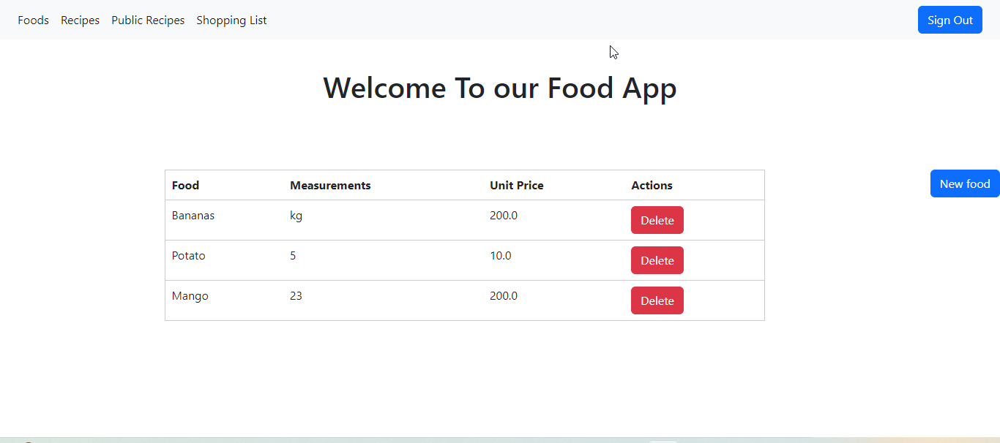

<h1 align="center">Food Recipe App</h1>


## 📗 Table of Contents

- [📗 Table of Contents](#-table-of-contents)
- [About the Project ](#about-the-project-)
- [🛠 Built With ](#-built-with-)
- [Key Features ](#key-features-)
- [🔭 Future Features ](#-future-features-)
- [💻 Getting Started ](#-getting-started-)
  - [🛠 Setup ](#-setup-)
  - [Prerequisites ](#prerequisites-)
  - [📖 Usage ](#-usage-)
- [👥 Authors ](#-authors-)
- [🤝 Contributing ](#-contributing-)
- [⭐️ Show Your Support ](#️-show-your-support-)
- [🙏 Acknowledgments ](#-acknowledgments-)
- [📜 License ](#-license-)

## About the Project <a name="about-project"></a>

The Food Recipe app keeps track of all your recipes, ingredients, and inventory. It will allow you to save ingredients, keep track of what you have, create recipes, and generate a shopping list based on what you have and what you are missing from a recipe. Also, since sharing recipes is an important part of cooking the app should allow you to make them public so anyone can access them.

## 🛠 Built With <a name="built-with"></a>

- Ruby on Rails
- Ruby
- HTML
- CSS

##  Key Features <a name="key-features"></a>

- [ ] User authentication and authorization.
- [ ] User can create, edit, and delete recipes.
- [ ] User can create and delete ingredients.
- [ ] Unit testing
- [ ] Database

## 🔭 Future Features <a name="future-features"></a>

- [ ] User can create, edit, and delete recipes.
- [ ] User profiles with customizable avatars and preferences.
- [ ] Integration with external APIs for ingredient information and recipe suggestions.
- [ ] Meal planning features, including weekly menus and scheduling.
- [ ] User ratings and reviews for shared recipes.

## 💻 Getting Started <a name="getting-started"></a>

To get started with the Recipe App, follow the instructions below:

### 🛠 Setup <a name="setup"></a>

1. Clone the project repository:

   ```bash
   git clone https://github.com/mahdinoori2000/rails-group-capstone
    ```
2. Navigate to the project folder:

   ```bash
   cd recipe_app
   ```
### Prerequisites <a name="prerequisites"></a>
Before you can run the Blog App, make sure you have the following prerequisites and configurations in place:

- **Ruby**: Ensure that Ruby is installed on your machine. You can check if it's installed by running `ruby -v` in your terminal. If it's not installed, you can download and install it from the [official Ruby website](https://www.ruby-lang.org/en/documentation/installation/).

- **Ruby on Rails**: You'll need the Ruby on Rails framework installed. If you don't have it yet, you can install it using the following command:
  ```
  gem install rails
  ```

- **Code Editor**: You should have a code editor like Visual Studio Code (VSCode) installed. You can download VSCode from the [official website](https://code.visualstudio.com/).

- **Git**: Git is essential for version control. Make sure you have Git installed and configured on your system. You can download Git from the [official Git website](https://git-scm.com/downloads).

- **PostgreSQL**: Ensure that PostgreSQL is installed and properly configured on the server where you are developing the project. This project assumes the use of PostgreSQL as the default database. You can download PostgreSQL from the [official PostgreSQL website](https://www.postgresql.org/download/).

- **Ruby on Rails Configuration**: Make sure your Ruby on Rails project is configured to use PostgreSQL as the default database.

With these prerequisites and configurations in place, you'll be ready to set up and run the Blog App.

### 📖 Usage <a name="usage"></a>
Follow these steps to use the Blog App:

Open your terminal.

Navigate to the directory where the project files are located:

Copy code
```bash
cd /path/to/your/project/files
```
Start the Rails server:

Copy code
```bash
rails server
```
Open your web browser and go to http://localhost:3000 to access the Blog App.

## 👥 Authors <a name="authors"></a>

👤 **Richard Sikaonga**

- 👤 GitHub: [@Richard Sikaonga](https://github.com/richie1988)
- 👤 Twitter: [@Richard Sikaonga](https://twitter.com/RichardSikao)
- 👤 LinkedIn: [@Richad Sikaonga](https://www.linkedin.com/in/richard-sikaonga-039940275/)

👤 **Mahdi Noori**

- 👤 GitHub: [@Mahdi Noori](https://github.com/mahdinoori2000)
- 👤 Twitter: [@Mahdi Noori](https://twitter.com/@mahdinoori2000)
- 👤 LinkedIn: [@Mahdi Noori](https://linkedin.com/in/mahdi-noori-hc201)


## 🤝 Contributing <a name="contributing"></a>

Contributions, issues, and feature requests are welcome! 
Feel free to check the issues [page](https://github.com/mahdinoori2000/rails-group-capstone/issues) and contribute to the project.

## ⭐️ Show Your Support <a name="support"></a>
If you like this project, kindly drop a start ⭐️ for the [repository](https://github.com/mahdinoori2000/rails-group-capstone);

<p align="right">(<a href="#readme-top">back to top</a>)</p>

<!-- ACKNOWLEDGEMENTS -->

## 🙏 Acknowledgments <a name="acknowledgements"></a>

**I would like to thank the following individuals and organizations for their contribution to this project.**

- I would like to express my heartfelt gratitude to [**Microverse**]
<p align="right">(<a href="#readme-top">back to top</a>)</p>

## 📜 License <a name="license"></a>
This project is [MIT](./MIT.md) licensed.

